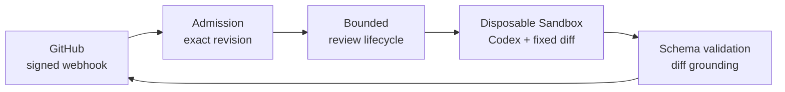

<p align="center">
  
</p>

<p align="center">
  <a href="https://github.com/ivand200/specode_review/actions/workflows/ci.yml"></a>
</p>

# SpeCodeReview

SpeCodeReview is a code review agent prototype for GitHub pull requests. It runs Codex in an
isolated sandbox, validates findings against changed code, and publishes a review tied to the exact
commit.

<!--
Replace this comment with a tightly cropped screenshot of a real review comment:


-->

## Why it exists

AI-assisted review becomes unreliable when the code moves during a review, repository content can
change the agent's instructions, or a plausible finding refers to code that was never changed.
SpeCodeReview keeps that boundary deliberately narrow:

- every attempt is bound to an immutable base and head commit;
- repository code, PR text, and repository-provided agent configuration are untrusted input;
- Codex runs in a disposable Docker Sandbox without GitHub credentials;
- every reported path and line is validated against the accepted diff;
- cleanup completes before one revision-bound comment is published.

## How it works



The host verifies the webhook and accepted revision, materializes a bounded merge-base diff, and
gives the sandbox a disposable workspace. The model returns a schema-constrained candidate; the
host validates and grounds it before publishing. Redelivery of an active or completed revision
does not repeat work, and the service rejects new work when its bounded capacity is full.

## Design decisions

| Decision | What it prevents |
|---|---|
| Bind work to accepted base and head SHAs | Reviewing a moving branch or reporting against the wrong revision |
| Keep GitHub credentials outside the sandbox | Untrusted code or model tools publishing directly |
| Ground every finding against the accepted diff | Hallucinated files, locations, or unchanged code |
| Clean up before idempotent publication | Duplicate or visible results from an incomplete transaction |

## Run the complete app locally

### 1. Install prerequisites

You need Python 3.12+, [`uv`](https://docs.astral.sh/uv/), Git, curl, Node.js/npm,
[ngrok](https://ngrok.com/), and a host supported by
[Docker Sandboxes](https://docs.docker.com/ai/sandboxes/get-started/). The service currently pins
`sbx 0.35.0` and Codex CLI `0.144.6`.

On supported macOS hosts:

```bash
brew trust docker/tap
brew install docker/tap/sbx
sbx login
npm install --global @openai/codex@0.144.6
sbx secret set -g openai --oauth
```

### 2. Create the GitHub App

Configure a private GitHub App with:

- **Contents:** read-only
- **Pull requests:** read and write
- **Event:** pull request

Generate a private key and install the App on each repository it should review. The local launcher
will display the exact webhook URL after ngrok starts and wait for you to set it in the App.

### 3. Configure the project

```bash
uv sync --locked
cp .env.example .env
chmod 600 .env
```

Set the GitHub App ID, webhook secret, absolute private-key path, and model policy in `.env`. Keep
the OpenAI credential in the Docker Sandboxes credential proxy, not in `.env`.

### 4. Start the app

```bash
./scripts/run-local.sh
```

The launcher starts ngrok and SpeCodeReview, prints the expected GitHub webhook URL, and waits until
the App configuration matches. Readiness is available at `http://127.0.0.1:8000/health/ready`.
Pass a reserved ngrok origin when available:

```bash
./scripts/run-local.sh https://your-domain.ngrok.app
```

Open or update a non-draft pull request to trigger a review. Add the `no-review` label when a pull
request should be skipped.

## Development

The default verification suite is network-free:

```bash
uv run ruff check .
uv run mypy
uv run pytest
```

## Current limitations

- One application process on one dedicated host; multi-host coordination is not supported.
- No durable queue or workflow state; distinct work is rejected when capacity is full.
- Execution depends on Docker Sandboxes and its host-managed credential proxy.

## Documentation

- [Production deployment and operations](docs/deployment.md)
- [Signed end-to-end release validation](docs/release-validation.md)
- [Configuration reference](.env.example)

SpeCodeReview is a prototype maintained by Ivan. Feedback and design discussion are welcome through
GitHub Issues. Licensed under the [MIT License](LICENSE).
