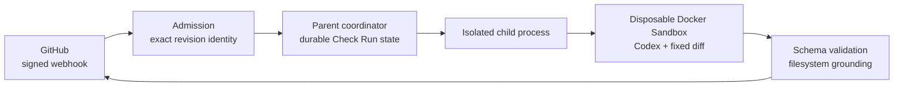

<p align="center">
  
</p>

# SpeCodeReview v0.1.0

[](https://github.com/ivand200/specode_review/actions/workflows/ci.yml)

SpeCodeReview is a security-focused GitHub App that reviews the exact commit accepted from a
signed pull-request webhook. It runs Codex in a disposable Docker Sandbox, validates and grounds
the result, then publishes revision-bound findings through a GitHub Check Run and one pull-request
comment.

This is a production-oriented prototype with a deliberately narrow deployment model: one process,
one configured repository, and one dedicated host or VM. The product is **SpeCodeReview**;
`Review Agent` is the GitHub Check Run name, and `review-agent` is the Python package and CLI.

## Why it exists

Automated review becomes risky when a moving branch, untrusted repository instructions, leaked
credentials, or a half-completed GitHub write can change what was reviewed or reported.
SpeCodeReview makes those failure modes explicit and bounded:

- Every attempt is bound to an immutable repository, pull request, base SHA, and head SHA.
- Repository code, PR text, and repository-provided agent configuration are treated as untrusted.
- Codex runs in an isolated child process and disposable microVM with restricted network access.
- GitHub credentials stay on the host; only the outer application can publish.
- Candidate JSON, file paths, changed locations, process output, and runtime are validated and
  bounded.
- Check Run updates are persisted before GitHub mutation and replayed after transient failure or
  restart.

## How it works



The host materializes and verifies the accepted head commit, computes a bounded merge-base diff,
and gives the sandbox a disposable copy. The model returns a schema-constrained candidate; the
application verifies that every finding refers to changed repository content before rendering the
final comment.

GitHub is the durable duplicate source. A redelivery for an already active or completed identity
does not repeat work. There is intentionally no waiting queue: the service starts up to
`MAX_CONCURRENT_REVIEWS` attempts and rejects distinct work at capacity.

## Key engineering decisions

| Decision | Failure mode addressed |
|---|---|
| Bind work to accepted base and head SHAs | Reviewing a moving branch or reporting against the wrong revision |
| Keep GitHub credentials outside the sandbox | Untrusted code or model tools publishing directly |
| Persist desired Check Run state before mutation | Lost or stale status after GitHub or process failure |
| Own one exact-revision comment | Duplicate comments across delivery and retry |
| Return findings and incomplete runs as `neutral` | An advisory reviewer accidentally blocking merges |
| Use one process, repository, and host ownership domain | Ambiguous coordination and split-brain recovery |

## Quick start

### Prerequisites

- Python 3.12 or later and [`uv`](https://docs.astral.sh/uv/)
- Git, curl, Node.js/npm, and [ngrok](https://ngrok.com/) for local webhook delivery
- A host supported by
  [Docker Sandboxes](https://docs.docker.com/ai/sandboxes/get-started/)
- `sbx 0.35.0` and `Codex CLI 0.144.6` (enforced at startup)

On supported macOS hosts:

```bash
brew trust docker/tap
brew install docker/tap/sbx
sbx login
npm install --global @openai/codex@0.144.6
```

Store the OpenAI credential in the Docker Sandboxes host-managed credential proxy. For OAuth:

```bash
sbx secret set -g openai --oauth
```

For an API key, use `sbx secret set -g openai` or import `OPENAI_API_KEY` with
`sbx secret import openai --force`, then remove it from the application environment. The
credential proxy supplies it to trusted model transport without exposing the real value inside
the sandbox.

### Configure the GitHub App

Install one GitHub App only on the repository configured by `GITHUB_REPOSITORY`:

- **Checks:** read and write
- **Contents:** read-only
- **Pull requests:** read and write
- Events: **Pull request** and **Check run**
- Webhook URL: `https://<public-host>/webhooks/github`

Use the same webhook secret for the App and `GITHUB_WEBHOOK_SECRET`. Keep the App private key on
the host.

### Configure and run

```bash
uv sync --locked
cp .env.example .env
chmod 600 .env
```

Edit `.env` and provide the GitHub App values plus absolute host paths for
`GITHUB_PRIVATE_KEY_PATH`, `REVIEW_KIT_PATH`, `STATE_ROOT`, and `WORKSPACE_ROOT`.
`STATE_ROOT` is private persistent state; keep it outside the disposable `WORKSPACE_ROOT`, preserve
it across restarts, and use a different root per repository.

`MAX_CONCURRENT_REVIEWS` is optional: it defaults to `1` and accepts values up to `10`. Size it for
the host's CPU, memory, and Sandbox capacity.

Start the service and ngrok:

```bash
./scripts/run-local.sh
```

The launcher loads `.env`, starts one service process and ngrok, checks local and public readiness,
and waits until the GitHub App webhook URL matches the tunnel. A reserved origin can be supplied as
the first argument:

```bash
./scripts/run-local.sh https://your-domain.ngrok.app
```

Health probes are available at `/health/live` and `/health/ready`.

## Review lifecycle

The service admits `pull_request/opened` for a non-draft PR. Each attempt creates a `Review Agent`
Check Run on the accepted head SHA:

- A clean review completes with `success`.
- Findings complete with `neutral` and publish in the revision-owned PR comment.
- Timeout, technical failure, and publication-unknown states complete with `neutral`.

Incomplete runs expose **Retry review**. A retry revalidates current GitHub state, preserves the
incomplete run as terminal evidence, and creates a fresh Check Run for the same accepted revision.
SpeCodeReview is advisory: **do not configure `Review Agent` as a required status check**.

## Verification

The default suite is network-free:

```bash
uv run ruff check .
uv run mypy
uv run pytest
```

The real-system campaign adds a no-model Sandbox lifecycle, a controlled GitHub retry lifecycle,
and one full production/model lifecycle:

```bash
set -a
source .env
set +a
uv run review-agent-real-e2e \
  --repository <owner/test-repository> \
  --evidence-root /tmp/review-agent-real-e2e
```

This command creates documented external resources and makes one model request. Read the
[live rollout guide](tests/live/README.md#ordered-truthful-real-e2e-campaign) before running it;
the guide covers prerequisites, evidence, interruption handling, and cleanup.

## Operational constraints

- Run exactly one application process for one repository on one host. Multiple hosts serving the
  same repository are unsupported.
- Separate repository processes need distinct state roots, workspace roots, and sandbox prefixes.
- Back up `STATE_ROOT`; it holds bounded reconciliation and active-attempt records, not credentials,
  repository content, PR text, model output, or findings.
- On shutdown, readiness drops before admission stops, active attempts retain their bounded
  cleanup budget, and the parent makes a final Check Run reconciliation pass.
- The project intentionally has no production Dockerfile: the orchestrator must run on a supported
  Docker Sandboxes host with its microVM and credential-proxy guarantees.

## Project status and license

SpeCodeReview is a v0.1.0 production-oriented prototype intended to demonstrate exact-revision
review, explicit trust boundaries, and failure-aware GitHub integration. No license file is
currently provided.
