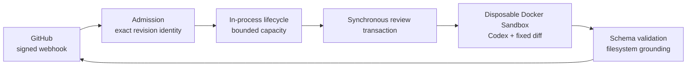

<p align="center">
  
</p>

# SpeCodeReview v0.1.0

[](https://github.com/ivand200/specode_review/actions/workflows/ci.yml)

SpeCodeReview is a security-focused GitHub App that reviews the exact commit accepted from a
signed pull-request webhook. It runs Codex in a disposable Docker Sandbox, validates and grounds
the result, then publishes one revision-bound pull-request comment.

This is a production-oriented prototype with a deliberately narrow deployment model: one process,
one GitHub App, and one dedicated host or VM. It serves every repository authorized for that App.
The product and GitHub App are **SpeCodeReview**, the Python package and logger namespace are
`specode_review`, and installed commands and owned runtime resources use `specode-review`.

## Why it exists

Automated review becomes risky when a moving branch, untrusted repository instructions, leaked
credentials, or a half-completed GitHub write can change what was reviewed or reported.
SpeCodeReview makes those failure modes explicit and bounded:

- Every attempt is bound to an immutable repository, pull request, base SHA, and head SHA.
- Repository code, PR text, and repository-provided agent configuration are treated as untrusted.
- Codex runs in a disposable microVM with restricted network access.
- GitHub credentials stay on the host; only the outer application can publish.
- Candidate JSON, file paths, changed locations, process output, and runtime are validated and
  bounded.
- Cleanup must complete before the final comment can be published.

## How it works



The host materializes and verifies the accepted head commit, computes a bounded merge-base diff,
and gives the sandbox a disposable copy. The model returns a schema-constrained candidate; the
application verifies that every finding refers to changed repository content before rendering the
final comment.

The exact-revision application-owned comment is the duplicate source. A redelivery for an active
or completed identity does not repeat work. There is intentionally no waiting queue: the service
starts up to
`MAX_CONCURRENT_REVIEWS` attempts and rejects distinct work at capacity.

## Key engineering decisions

| Decision | Failure mode addressed |
|---|---|
| Bind work to accepted base and head SHAs | Reviewing a moving branch or reporting against the wrong revision |
| Keep GitHub credentials outside the sandbox | Untrusted code or model tools publishing directly |
| Own one exact-revision comment | Duplicate comments across webhook redelivery |
| Cleanup before publication | A developer seeing a result from an incompletely isolated transaction |
| Use one process and host-wide capacity limit | Queues and hidden per-repository reservations |

## Quick start

### Prerequisites

- Python 3.12 or later and [`uv`](https://docs.astral.sh/uv/)
- Git, curl, Node.js/npm, and [ngrok](https://ngrok.com/) for local webhook delivery
- A host supported by
  [Docker Sandboxes](https://docs.docker.com/ai/sandboxes/get-started/)
- `sbx 0.35.0` and `Codex CLI 0.144.6` (enforced at startup)

On supported macOS hosts:

```bash
brew trust docker/tap
brew install docker/tap/sbx
sbx login
npm install --global @openai/codex@0.144.6
```

Store the OpenAI credential in the Docker Sandboxes host-managed credential proxy. For OAuth:

```bash
sbx secret set -g openai --oauth
```

For an API key, use `sbx secret set -g openai` or import `OPENAI_API_KEY` with
`sbx secret import openai --force`, then remove it from the application environment. The
credential proxy supplies it to trusted model transport without exposing the real value inside
the sandbox.

### Configure the GitHub App

Install the GitHub App on every repository the service should review:

- **Contents:** read-only
- **Pull requests:** read and write
- Event: **Pull request**
- Webhook URL: `https://<public-host>/webhooks/github`

Use the same webhook secret for the App and `GITHUB_WEBHOOK_SECRET`. Keep the App private key on
the host.

### Configure and run

```bash
uv sync --locked
cp .env.example .env
chmod 600 .env
```

Edit `.env` with the App identity and secret, complete stable HTTPS webhook URL, model policy, and
optional ingress values. Production paths and runtime limits are fixed by the application and
documented in `.env.example`.

`MAX_CONCURRENT_REVIEWS` defaults to `3` and accepts only `1` through `5`. Size it from measured
host behavior.

Load the environment and start the loopback service:

```bash
set -a
source .env
set +a
uv run specode-review
```

Health probes are available at `/health/live` and `/health/ready`.

## Production installation

The supported production target is a native Ubuntu host running `systemd`. Clone the repository
at `/opt/specode-review`, fetch the release tags, and detach at the exact supported tag:

```bash
sudo git clone <repository-url> /opt/specode-review
sudo git -C /opt/specode-review fetch --tags
sudo git -C /opt/specode-review checkout --detach v0.1.0
```

Install `uv`, Git, curl, `runuser`, `systemd`, `sbx 0.35.0`, and Codex CLI `0.144.6` in the system
`PATH`. Managed reserved-ngrok ingress additionally requires ngrok `3.39.1`. Configure Docker
Sandboxes for the dedicated service identity; model credentials must use its host-managed
credential store and must not be placed in `.env`:

```bash
sudo -u specode-review env -i \
  HOME=/var/lib/specode-review \
  PATH=/usr/local/bin:/usr/bin:/bin:/usr/local/sbin:/usr/sbin:/sbin \
  sbx secret set -g openai --oauth
```

On a first installation the installer creates the `specode-review` identity. If it is not yet
present when configuring the credential, run the installer once to provision managed host state,
configure the credential with the command above, and rerun the same installer command.

Create `/opt/specode-review/.env` from `.env.example` and place the unencrypted RSA GitHub App key
at `/opt/specode-review/.secrets/github-app.pem`. Then install or repair the selected release:

```bash
cd /opt/specode-review
sudo ./scripts/install.sh --release v0.1.0
```

The installer rejects branches, commits that are not exactly tagged, unsupported tags, malformed
or placeholder configuration, model credentials in the application environment, unsafe secret
files, and unpinned host tools. It converges the non-login service user and restrictive managed
paths, installs the locked non-development environment with `uv`, runs a disposable no-model
Sandbox capability probe, writes `specode-review.service`, and enables and starts it. When
`NGROK_URL` and `NGROK_AUTHTOKEN` are set, their reserved HTTPS origin must match
`PUBLIC_WEBHOOK_URL`; the installer also writes and starts the separate
`specode-review-ngrok.service`.

After startup, installation waits up to ten minutes for the GitHub App webhook URL to match
`PUBLIC_WEBHOOK_URL` and otherwise leaves both supervised units running with manual correction
instructions. It never mutates GitHub App configuration.

The unit listens through the application's fixed `127.0.0.1:8000` bind, logs to `journald`,
restarts after failures no more than five times in five minutes, and allows up to twenty minutes
for graceful shutdown:

```bash
sudo systemctl status specode-review
sudo journalctl -u specode-review --since today
sudo systemctl restart specode-review
# Managed ngrok mode:
sudo systemctl status specode-review-ngrok
sudo journalctl -u specode-review-ngrok --since today
```

Upgrade and rollback use the same operation after checking out another exact supported release
tag. The installer never runs `git clean`, deletes foreign Docker Sandboxes, or changes GitHub App
configuration.

## Review lifecycle

The service admits non-draft `opened`, `synchronize`, `ready_for_review`, and `reopened` pull
requests unless they carry the `no-review` label. Preflight proves App access and exact-revision
idempotency before capacity is consumed. Accepted work runs one cleanup-before-publication
transaction. A clean review and a review with findings both publish one top-level comment;
technical failures are visible only in safe structured operator logs.

## Installation verification

Repeat the production verifier after installation, upgrade, rollback, or repair:

```bash
sudo ./scripts/verify-install.sh
```

It checks required units, local and public health, the configured GitHub App identity and webhook
URL, pinned host tools, and the trusted review kit. It then creates, limits, mounts, executes,
inspects, lists, and force-removes one network-denied temporary Sandbox and confirms that no
SpeCodeReview-owned Sandbox or workspace remains. Output contains only bounded pass/fail evidence.
The verifier never invokes Codex, spends model tokens, or publishes a GitHub review.

Run verification while the service is otherwise idle so an active bounded review is not mistaken
for a stale owned resource.

## Development verification

The default suite is network-free:

```bash
uv run ruff check .
uv run mypy
uv run pytest
```

The network-free suite includes the no-model Sandbox probe contract. The separately installed
`specode-review-real-e2e` command is reserved for the signed, model-backed production campaign;
that campaign remains unavailable until its comment-only production-path implementation lands.

## Operational constraints

- Run exactly one application process on one host. Multiple hosts serving the same repository are
  unsupported.
- There is no durable workflow state, retry queue, or per-repository capacity reservation.
- On shutdown, readiness and admission close before already accepted bounded reviews are drained.
- The project intentionally has no production Dockerfile: the orchestrator must run on a supported
  Docker Sandboxes host with its microVM and credential-proxy guarantees.

## Project status and license

SpeCodeReview is a v0.1.0 production-oriented prototype intended to demonstrate exact-revision
review, explicit trust boundaries, and failure-aware GitHub integration. No license file is
currently provided.
