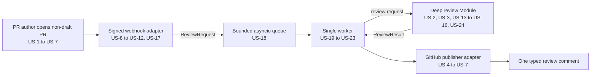
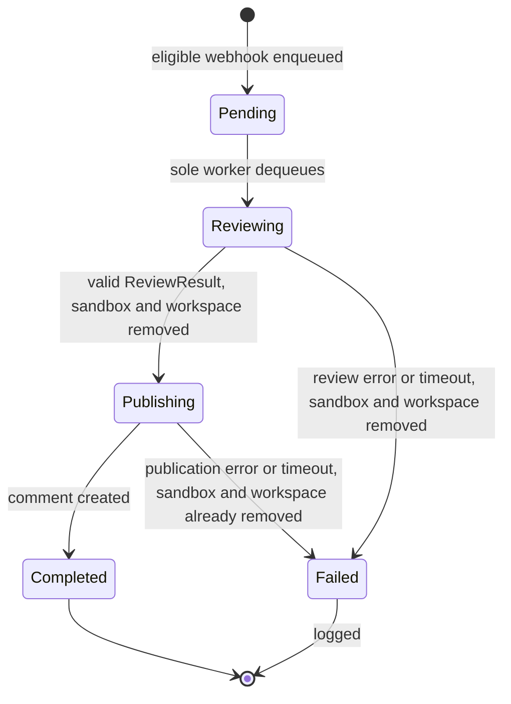

# Code Review Agent V0.1

## Problem Statement

A pull-request author in one predefined GitHub repository needs a fast, repeatable first code-review pass without manually invoking a local tool. Opening a pull request should be enough to trigger the review, and the result should appear in that pull request in a predictable form.

The first version must prove the complete product path—GitHub trigger, exact source checkout, code inspection, typed result, and published comment—without becoming a general job-processing platform. It must run no more than one review at a time, reject unsafe or invalid input, bound expensive work, and avoid publishing unvalidated model text.

For V0.1, “reliable” means correct, bounded, and observable while one application process is running. Accepted or active work is not crash-durable: a process restart may lose it. That limitation is explicit so the implementation can remain an in-memory single-worker application rather than introducing SQLite, migrations, leases, or recovery state before the product path is proven.

## Solution

Run one Python application configured for one GitHub repository. GitHub sends a signed webhook when a non-draft pull request is opened. The application authenticates and filters the event, converts it into a typed `ReviewRequest`, and adds it to a bounded in-memory queue before responding.

One worker consumes that queue sequentially. For each request, the review Module clones the configured repository into an isolated temporary host workspace, fetches the pull-request head ref, checks out the exact head commit named by the accepted webhook, and fixes one merge-base-to-head diff range. It then creates one fresh Docker Sandbox microVM, applies an application-owned review mixin kit, mounts the frozen host checkout read-only, copies it into writable VM-local storage, verifies the copied head commit, and runs Codex CLI non-interactively against that disposable copy. Codex may read, write, delete, search, build, and execute code inside the microVM, but only its schema-constrained review JSON can leave the sandbox. Application code validates and grounds that output, combines it with trusted request data into a typed `ReviewResult`, and returns it through the primary review Interface.

A GitHub publisher adapter deterministically renders the successful `ReviewResult` as one top-level pull-request comment. The sandbox and host workspace are removed after every attempt. A failed review is logged and publishes no potentially misleading result; the worker then continues with the next queued request using a newly created sandbox.

## User Stories

1. As a pull-request author, I want opening a pull request in the configured repository to trigger a review, so that I do not need to invoke the reviewer manually.
2. As a pull-request author, I want the reviewer to inspect the exact commit I opened the pull request with, so that its findings correspond to a known revision.
3. As a pull-request author, I want the reviewer to inspect the pull request’s changes relative to their merge base, so that unrelated target-branch history is not reviewed as my change.
4. As a pull-request author, I want important defects summarized in one pull-request comment, so that I can act on them before merging.
5. As a pull-request author, I want a clear no-important-issues result when no qualifying defect is found, so that silence is not confused with a failed review.
6. As a pull-request author, I want each finding to identify evidence and an affected location, so that I can verify and fix it efficiently.
7. As a pull-request author, I want review comments to identify the exact reviewed commit range, so that I can recognize results made stale by later commits.
8. As a repository maintainer, I want draft pull requests to be ignored, so that unfinished work does not consume review capacity.
9. As a repository maintainer, I want only newly opened pull requests to trigger V0.1, so that trigger behavior is narrow and predictable.
10. As a repository maintainer, I want events from every repository except the configured repository to be ignored, so that one deployment cannot review unintended code.
11. As a repository maintainer, I want webhook signatures verified before work is accepted, so that an unauthenticated caller cannot spend model or repository resources.
12. As a repository maintainer, I want repository contents and pull-request text treated as untrusted data, so that embedded instructions cannot redefine the reviewer’s policy or capabilities.
13. As a repository maintainer, I want repository execution confined to a fresh disposable microVM with a read-only host checkout, isolated credentials, and restricted networking, so that autonomous review cannot modify the host checkout or escape into the application environment.
14. As a repository maintainer, I want only blocking or important findings reported, so that the review is useful rather than dominated by style feedback.
15. As a repository maintainer, I want model output structurally validated and grounded in the reviewed checkout, so that fabricated files or invalid lines are never published.
16. As a repository maintainer, I want oversized pull requests rejected before model inference, so that resource use remains bounded and a partial review is not presented as complete.
17. As an operator, I want the webhook acknowledged without waiting for the review, so that GitHub delivery is not coupled to clone or model latency.
18. As an operator, I want queue capacity to be bounded, so that a burst of pull requests cannot grow memory use without limit.
19. As an operator, I want no more than one review executing at a time, so that model and machine resource usage is predictable.
20. As an operator, I want an active review to have a configured deadline, so that a stuck clone, model call, or publication does not block all later reviews forever.
21. As an operator, I want failure of one review not to stop the worker, so that later queued reviews can still complete.
22. As an operator, I want each sandbox and temporary host workspace removed after success, validation failure, publication failure, or timeout, so that checked-out source and agent-mutated state do not accumulate or cross review attempts.
23. As an operator, I want failures logged with the pull request, exact head commit, stage, and normalized error category, so that a missing comment can be diagnosed.
24. As a developer, I want the core review behavior available through one typed Interface, so that I can test the product behavior without depending on webhook or GitHub comment details.
25. As a developer, I want normal tests to use fake GitHub and Codex runner adapters, so that the suite is deterministic and does not require Docker, credentials, or model budget.
26. As a developer, I want one mocked webhook-to-comment smoke test, so that the adapters and the core review path are proven to connect correctly.

## Implementation Decisions

### Scope and runtime

- V0.1 is one Python application using FastAPI, Pydantic, Docker Sandboxes, Codex CLI, `uv`, and `pytest`. It does not depend on `pydantic-ai`.
- One deployment is configured for one canonical GitHub `owner/repository`.
- The application runs as one process with one web-server worker. Application lifespan owns one bounded `asyncio.Queue` and exactly one consumer task.
- The queue capacity is ten `ReviewRequest` values. An eligible webhook is accepted only after `put_nowait` succeeds. A full queue returns `503 Service Unavailable` and does not claim that the review was accepted.
- The queue is deliberately not durable. Process termination may lose queued or active work and may require manual GitHub webhook redelivery. This is an accepted V0.1 limitation, not an unreported guarantee.
- Graceful shutdown stops accepting new work and allows the active review a bounded opportunity to finish. Abrupt process termination has no recovery guarantee.
- Configuration is validated before the application accepts traffic. Required configuration covers the repository, GitHub App credentials, webhook secret, Codex model, application-owned review kit, workspace root, a 15-minute default end-to-end review timeout, sandbox resource limits, and subprocess/output limits. Startup readiness also checks the pinned `sbx` and Codex versions and validates the mixin kit.
- OpenAI authentication uses the Docker Sandbox host-managed credential proxy. OAuth is preferred; a proxy-stored OpenAI API key is a supported fallback. GitHub and raw OpenAI credentials must not enter the sandbox or appear in clone URLs, logs, prompts, exceptions returned to webhook callers, or model-visible output.

### Webhook adapter

- The adapter reads the raw request body and verifies `X-Hub-Signature-256` with the configured webhook secret before parsing trusted fields or enqueueing work.
- Only `X-GitHub-Event: pull_request` with payload action `opened` is eligible. Draft pull requests and events for a repository other than the configured repository are successful no-ops.
- A valid eligible webhook is converted to `ReviewRequest`, enqueued once for that delivery, and acknowledged with `202 Accepted`. Clone, model, and publication work never run in the request handler.
- An invalid signature returns an authentication error and enqueues nothing. A malformed eligible payload returns a client error and enqueues nothing. An unsupported or ineligible event returns a successful no-op response.
- V0.1 does not deduplicate GitHub delivery identifiers. Duplicate deliveries can therefore create duplicate queued reviews and comments.

### Single-review scheduler

- The scheduler owns pending request order and the invariant that at most one call to the review Interface is active.
- Requests are processed in FIFO order. The worker completes review and publication for one request before taking the next.
- One configured timeout, defaulting to 15 minutes, covers GitHub credential acquisition, repository materialization, sandbox creation, review, result validation, comment publication, and cleanup. Each operation receives only the remaining deadline. The review Module runs forced sandbox removal and workspace cleanup from a `finally` path, so the scheduler cannot accidentally skip them when that deadline expires during normal process operation.
- A review, validation, timeout, or publication failure is logged and publishes no final comment for that attempt. The worker catches the failure, marks the queued item complete, and continues.

### Primary review Module and Interface

- The sole external seam for core behavior is `review(ReviewRequest) -> ReviewResult`. Callers and core behavior tests use this same Interface.
- The Module owns repository materialization, fixed diff selection, size checks, sandbox and agent execution, output validation, result derivation, and sandbox/workspace lifecycle. These are implementation details rather than separately public pipeline Interfaces.
- The Interface preconditions are: a trusted caller supplies a structurally valid request for the configured repository with immutable commit identifiers and a positive pull-request number. Webhook authentication and eligibility filtering belong to the webhook adapter rather than this Interface.
- The Interface postcondition is: a returned result describes exactly the request’s repository, pull request, and accepted head commit; its diff start is the one computed merge base; its status is derived from its validated findings; and its sandbox and temporary host workspace have been removed.
- Expected failures are categorized as repository materialization, review too large, sandbox lifecycle, Codex/limit, invalid model output, timeout, and publication-independent review failure. The Module does not turn a failure into an empty successful result.
- The Interface promises bounded work, not a fixed completion latency. Its upper bound is the configured review timeout plus cleanup time.

Two Python designs were compared:

- **Selected: one deep review Module using functions, value-like Pydantic models, and internal composition.** Callers learn one Interface while clone, Git, agent, and validator complexity remains local. Dependencies are accepted by construction so fake adapters can be supplied in tests.
- **Rejected: a public stage pipeline exposing clone, diff, agent, validation, and cleanup objects to the worker.** It would make each step individually replaceable, but callers and tests would need to understand ordering, workspace state, revision invariants, and cleanup. That is a shallow, leaky design for the single demonstrated workflow.

No inheritance hierarchy, public stage classes, or pattern-specific framework is required. A Python `Protocol` is introduced only where both a production adapter and a test fake actually exist, such as Codex execution or GitHub publication; it does not split the primary review Interface.

### Codex Sandbox runner

- `CodexSandboxRunner` is an internal adapter accepted by the deep review Module. Its test fake is used by normal core tests; neither adapter becomes a second public product Interface.
- Each invocation creates one uniquely named Docker Sandbox. Because the scheduler calls the review Interface sequentially, no more than one review sandbox runs at a time.
- The runner applies a pinned, application-owned Docker Sandbox mixin kit. The kit supplies the trusted root instructions, `.agents/skills/code-review` skill and references, required local tooling, and an OpenAI-only network policy. Docker's kit format is experimental, so the pinned `sbx` version and `sbx kit validate` are part of the reviewed runtime contract.
- Repository `AGENTS.md`, `.codex` configuration, hooks, rules, skills, and MCP declarations remain untrusted files. Codex starts from the application-owned control workspace rather than the nested target repository, ignores user configuration, and loads no repository-provided agent configuration.
- The service mounts the frozen host checkout read-only and a request-specific control directory read-write. Before Codex starts, the runner copies the checkout into VM-local writable storage and verifies that its `HEAD` equals `ReviewRequest.head_sha`.
- Codex runs once in non-interactive, ephemeral, schema-constrained mode with its internal approvals and sandbox bypassed because the Docker Sandbox microVM is the execution boundary. It may mutate or destroy its VM-local copy; all such state is discarded.
- The runner captures bounded JSONL diagnostics and the final message without sending GitHub credentials into the sandbox. It returns only the final candidate `AgentReview` payload or a normalized failure.
- Every terminal path attempts `sbx rm --force` and host-workspace cleanup. Startup may sweep abandoned sandboxes only when their names match the application-owned naming convention, just as it may sweep matching orphan workspaces.

### Repository materialization and fixed diff

- Each review uses a unique host directory under a dedicated workspace root and a unique sandbox name under an application-owned prefix.
- The implementation clones the configured base repository, fetches the event’s base commit and `refs/pull/<number>/head`, verifies the event’s exact head commit exists, and checks out that commit in detached-head mode. A moving branch or newer pull-request head never replaces the commit named by the accepted request.
- The implementation computes the merge base of the accepted base and head commits once. Failure to obtain either commit or a merge base fails the review.
- One immutable `DiffRange` is then used for the changed-path manifest, every diff tool result, grounding validation, the typed result, and the published comment. Neither the agent nor a downstream caller can select or recompute revisions.
- Fork pull requests are supported by fetching GitHub’s pull-request head ref from the configured base repository rather than assuming the source branch exists there.
- Installation credentials are ephemeral, are never persisted in the checkout’s remote URL or Git configuration, and are removed before the checkout is mounted into the sandbox.
- On startup, the application may remove orphan directories and Docker Sandboxes only when they belong to its dedicated roots/prefixes and match its own naming convention. It does not attempt to recover their reviews.

### Bounded sandboxed review

- Before model inference, the Module builds a deterministic changed-path manifest from the fixed diff.
- A review is rejected before the first model request when it changes more than 100 files or more than 5,000 added and deleted text lines. Binary files count toward the file limit but not the text-line limit.
- Pull-request description context is limited to 10,000 characters with a visible truncation marker. Captured subprocess output, valid result size, sandbox resources, and total review duration are bounded by configuration. V0.1 does not claim model-request or tool-call limits that Codex CLI cannot enforce.
- The agent receives trusted application-owned review instructions and skills, untrusted pull-request title and description, the fixed diff range, and the changed-path manifest.
- Repository instructions, source files, comments, pull-request text, agent configuration, hooks, rules, and skills remain untrusted data. They cannot change the trusted review kit, network policy, publication behavior, or application validation.
- Codex may read, search, modify, delete, build, test, and execute repository code inside its writable VM-local copy. It cannot modify the read-only host checkout, access the host or GitHub credentials, persist VM state across reviews, or reach any network destination except the OpenAI service through Docker's credential proxy.
- Dependency installation and tests that require non-OpenAI network services are not guaranteed to work in V0.1. The agent uses the tools and dependencies already present in the kit or repository and fails or falls back to inspection when offline execution is insufficient.
- The review policy asks for no more than five blocking or important defects introduced or exposed by the pull request. Style, naming, formatting, speculative concerns, and minor improvements are omitted.

### Typed result and grounding

- Pydantic models validate both model-authored data and the application-owned result. Models that represent accepted request identity and the fixed diff are immutable.
- The model authors only `AgentReview`. It does not author repository identity, pull-request identity, commit identity, overall status, Markdown, or the final GitHub comment.
- Every model-authored finding must pass structural validation and deterministic grounding. At least one location must be a changed path; every path must remain inside the checkout and either exist at the reviewed head or be a deleted changed path; and every provided line must exist in the referenced head text file.
- A parsing, structural, or grounding error rejects the whole candidate output and immediately fails the review. V0.1 performs no corrective Codex rerun. Invalid findings are never silently dropped and never converted into a no-issues result.
- Application code derives `ReviewResult.status`: zero findings means `no_important_issues`; one or more findings means `issues_found`.
- All collections and strings have explicit limits so any valid result can be rendered below GitHub’s comment-size limit.

### GitHub publisher adapter

- After `review` returns successfully, the worker gives the typed result to the GitHub publisher adapter.
- Application code, not the model, renders deterministic Markdown containing an automated-review notice, the exact `start_sha..end_sha`, the derived status, and each finding’s severity, title, locations, evidence, impact, and suggested fix.
- Model-authored text is escaped or fenced so it cannot inject HTML, mentions, hidden markers, or application-owned headings.
- Each successful attempt creates one top-level pull-request comment. A clean result publishes an explicit fixed no-important-issues message.
- V0.1 does not create inline comments, approve a pull request, request changes, modify merge state, create an in-progress comment, or update an earlier comment.
- The GitHub App is installed only on the configured repository and has the minimum repository-read and pull-request-comment permissions required for clone, pull-request context, and one top-level comment.

## Review Map

### Product flow and reviewed contracts

The primary core test seam is the Interface between the single worker and the review Module. One higher product-flow smoke test crosses the webhook and publisher adapters with fake external dependencies.

### Interface: `ReviewRequest` (US-1 to US-3, US-8 to US-12, US-24)

- `{repository, string}`: required canonical `owner/repository`; must equal configured repository.
- `{pr_number, positive integer}`: required pull-request identity.
- `{installation_id, positive integer}`: required GitHub App installation identity used by application code only.
- `{base_sha, 40-character hexadecimal string}`: required base commit from the accepted webhook.
- `{head_sha, 40-character hexadecimal string}`: required exact pull-request head commit from the accepted webhook.
- `{title, string}`: required untrusted context with an explicit length limit.
- `{description, string}`: untrusted context, defaults to empty, truncated to 10,000 characters.

### Interface: `DiffRange` (US-2, US-3, US-7, US-15)

- `{start_sha, 40-character hexadecimal string}`: required merge base computed once by the review Module.
- `{end_sha, 40-character hexadecimal string}`: required exact `ReviewRequest.head_sha`; immutable.

### Interface: model-authored `AgentReview` (US-6, US-14, US-15)

- `{findings, list[Finding]}`: required, zero to five, ordered by material impact.

### Interface: `Finding` (US-4 to US-6, US-14, US-15)

- `{severity, "blocking" | "important"}`: required materiality.
- `{title, string}`: required, 1–160 characters.
- `{locations, list[Location]}`: required, one to three grounded locations.
- `{evidence, string}`: required, 1–1,200 characters of concrete repository evidence.
- `{impact, string}`: required, 1–600 characters explaining user or system consequence.
- `{suggested_fix, string}`: required, 1–600 characters describing a direction, not an automatic edit.

### Interface: `Location` (US-6, US-15)

- `{path, string}`: required repository-relative path, 1–512 characters.
- `{line, positive integer?}`: optional one-based line in the reviewed head; omitted for deleted files or file-level evidence.
- `{description, string?}`: optional cross-file context, 1–240 characters when present.

### Interface: application-owned `ReviewResult` (US-4 to US-7, US-24)

- `{repository, string}`: required; copied from the trusted request.
- `{pr_number, positive integer}`: required; copied from the trusted request.
- `{diff_range, DiffRange}`: required fixed reviewed range.
- `{status, "issues_found" | "no_important_issues"}`: required and derived only by application code.
- `{findings, list[Finding]}`: required validated findings, zero to five.

### State and failure flow (US-18 to US-23)

The only persistent user-visible success state is the pull-request comment. `Pending`, `Reviewing`, and `Failed` are in-process operational states and are lost on restart.

## Testing Decisions

- A good test observes the behavior promised by an Interface: accepted or rejected webhook response, queued request, returned typed result, published comment, concurrency bound, timeout behavior, or workspace cleanup. Tests do not assert private function order, internal class structure, exact prompts, or incidental Git command sequences.
- The primary test surface is `review(ReviewRequest) -> ReviewResult`, confirmed as the highest useful core seam. Tests supply controlled Git repositories and a fake Codex runner, then assert exact revision selection, size limits, sandbox input construction, grounding, typed status derivation, failure behavior, and cleanup through that Interface.
- Webhook adapter contract tests cover signature verification, repository and event filtering, malformed payloads, draft handling, `202` enqueue behavior, and `503` queue-full behavior.
- Scheduler behavior tests enqueue multiple controlled requests and prove that review concurrency never exceeds one, FIFO order is preserved, timeout does not skip cleanup, and one failure does not stop later work.
- Publisher adapter contract tests prove deterministic rendering, correct reviewed range, safe escaping of model-authored strings, explicit clean output, and no publication for a failed review.
- One mocked product-flow test begins with a signed webhook and ends with one captured GitHub comment. GitHub and the Codex runner are fake adapters; the test proves composition without Docker or network access.
- One real local-Git test creates diverged base and head histories and proves that checkout, changed-path manifest, frozen review input, grounding, typed result, and comment all use one merge-base-to-exact-head `DiffRange`.
- Grounding tests reject traversal, symlink escapes, nonexistent paths, out-of-range lines, and findings without a changed-path location. They prove that any invalid candidate fails immediately and publishes nothing.
- Limit tests prove that more than 100 changed files or 5,000 changed text lines fails before sandbox creation, and that queue, description, captured subprocess output, request, finding, comment, and end-to-end timeout bounds are enforced.
- Configuration tests prove that missing or invalid required settings, incompatible pinned runtime versions, or an invalid review kit fail startup before traffic is accepted and that secrets are absent from observable errors and logs.
- A sandbox lifecycle integration test, without a model call, proves read-only host mounting, writable VM-local copying, exact-HEAD verification, forced timeout cleanup, orphan sweeping, and absence of cross-review state across two sequential sandboxes.
- An opt-in live test proves that the trusted review kit and skill load, repository-owned `AGENTS.md` and `.codex` content do not become configuration, the OpenAI credential remains proxy-managed, OpenAI is the only reachable network service, output is Pydantic-valid, and the host checkout remains unchanged.
- Normal tests never call GitHub, Docker Sandboxes, or OpenAI and require no production credentials. The live test is opt-in because it requires Docker Sandbox readiness, a host-managed OpenAI credential, time, and model budget.
- The existing `libero` project provides prior art for pytest fixtures, Pydantic validation, fake external clients, clone/review/publish orchestration, and typed review artifacts. V0.1 reuses those testing ideas where useful but does not inherit its multi-provider, artifact-storage, inline-comment, or role-bundle scope.

## Out of Scope

- Durable queues, SQLite, SQLAlchemy, Alembic, leases, job recovery, and persistence across process restarts.
- Automatic job retries, publication retries, delivery deduplication, and exactly-once comment delivery.
- Pull-request actions other than `opened`, including `synchronize`, `reopened`, and `ready_for_review`.
- Re-review after new commits, current-head checks, stale-result suppression, and replacement of old comments.
- More than one configured repository, organization, tenant, or concurrent review.
- Multiple application processes, horizontal scaling, high availability, and external queue infrastructure.
- Manual review commands, scheduling, polling, and cron triggers.
- Executing repository code, tests, linters, builds, package installation, or arbitrary shell operations outside the disposable Docker Sandbox.
- Agent access to GitHub credentials, the host filesystem outside declared mounts, non-OpenAI network destinations, or VM state from another review.
- Persisting agent edits, returning or publishing generated patches, pushing commits, approving, requesting changes, or blocking merges. Codex may make transient edits inside its disposable VM-local copy, but they are never product output.
- Inline review comments, GitHub Checks, in-progress comments, and comment updates.
- Binary-content review, exhaustive whole-repository review, repository indexing, embeddings, RAG, batching, and multi-agent review.
- Model providers other than the configured OpenAI model.
- Persisted prompts, transcripts, source snapshots, model tool output, usage analytics, and a review history UI.
- Production ingress, deployment automation, dashboards, quality benchmarks, and cost accounting beyond configured operational limits.

## Further Notes

- The design pressure is to preserve a complete, trustworthy review flow while avoiding infrastructure that does not improve the first user story. The selected design concentrates revision integrity, sandbox isolation, agent execution, validation, and cleanup in one deep review Module; the queue and GitHub integrations remain small adapters.
- Before this feature there is no implemented GitHub-only review Module in the repository. The adjacent `libero` code demonstrates a broader reviewer workflow, but V0.1 deliberately remains one-repository, one-provider, one-worker, and one-comment.
- “One review at a time” is a process-level invariant. Deploying more than one web-server worker or application replica would violate it and is therefore unsupported in V0.1.
- “One sandbox per review” is separate from concurrency: the worker creates and removes a fresh sandbox for each queued request, but never runs two review sandboxes at once.
- The typed `ReviewResult` is the product result and the stable core Interface. Markdown is a derived delivery format, not model output and not the source of truth.
- Future versions should add durability or deduplication only in response to observed restart loss, webhook volume, or a new availability requirement. They should preserve the primary review Interface unless a new user story creates real variation at that seam.
